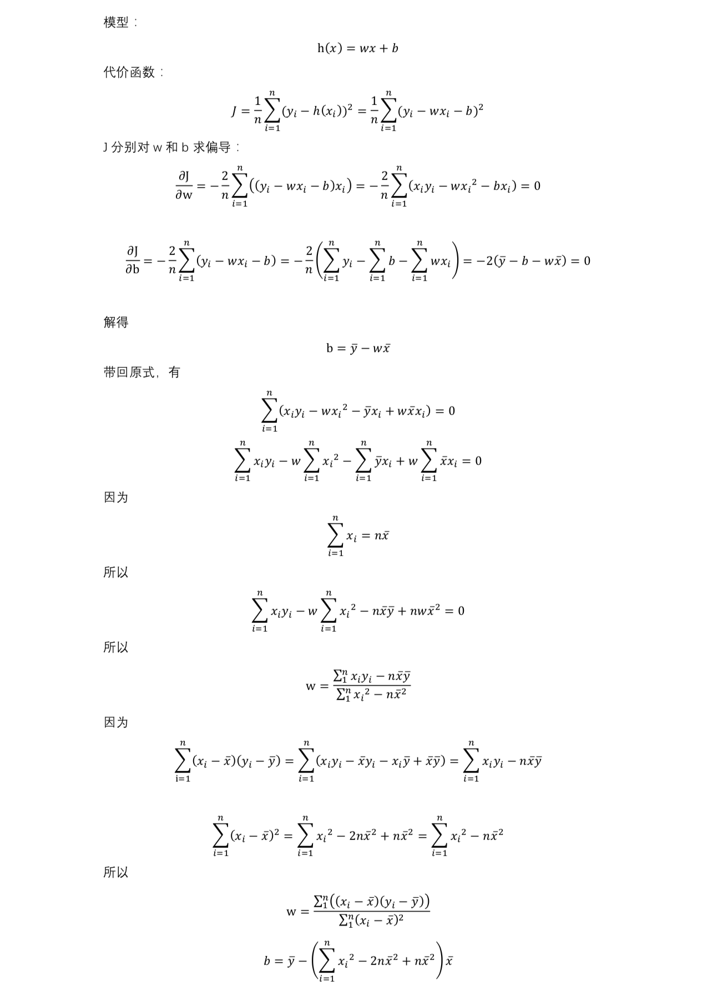
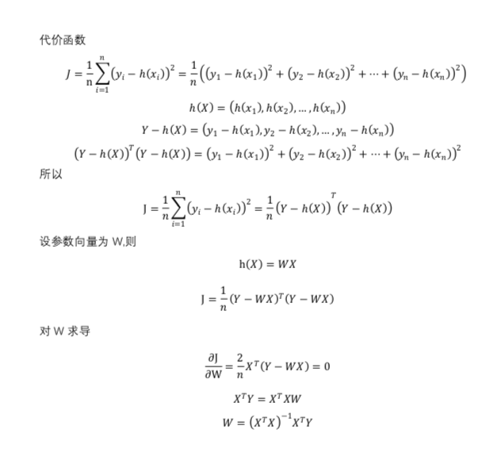
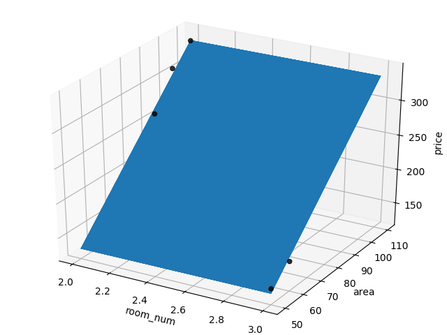

通常我们学习机器学习都是从线性回归模型开始的。线性回归模型形式简单、易于建模，但是我们可以从中学习到机器学习的一些重要的基本思想。

> **回归**一词的由来：
>
> 这个术语是英国生物学家兼统计学家高尔顿在1886年左右提出来的。人们大概都注意到，子代的身高与其父母的身高有关。高尔顿以父母的平均身高X作为自变量，其一成年儿子的身高Y为因变量。他观察了1074对父母及其一成年儿子的身高，将所得(X, Y)值标在直角坐标系上，发现二者的关系近乎一条直线，总的趋势是X增加时Y倾向于增加，这是意料中的结果.有意思的是,高尔顿对所得数据做了深入一层的考察，而发现了某种有趣的现象。
>
> 高尔顿算出这1074个X值的算术平均为68英寸(1英寸为2.54厘米),而1074个Y值的算术平均为69英寸，子代身高平均增加了1英寸，这个趋势现今人们也已注意到。以此为据，人们可能会这样推想:如果父母平均身高为a英寸,则这些父母的子代平均身高应为a+1英寸，即比父代多1英寸。但高尔顿观察的结果与此不符，他发现:当父母平均身高为72英寸时，他们的子代身高平均只有71英寸,不仅达不到预计的72+1=73英寸，反而比父母平均身高小了。反之,若父母平均身高为64英寸，则观察数据显示子代平均身高为67英寸，比预计的64+1=65英寸要多。
>
> 高尔顿对此的解释是:大自然有一种约束机制，使人类身高分布保持某种稳定形态而不作两极分化。这就是种使身高“回归于中心”的作用 例如，父母身高平均为72英寸，比他们这一代平均身高68英寸高出许多，“回归于中心”的力量把他们子代的身高拉回来些：其平均身高只有71英寸，反比父母平均身高小，但仍超过子代全体平均69英寸。反之，当父母平均身高只有64英寸，远低于他们这代的平均值68英寸时，“回归于中心”的力量将其子代身高拉回去一些，其平均值达到67英寸，增长了3英寸，但仍低于子代全体平均值69英寸。
>
> 正是通过这个例子，高尔顿引人了“回归”这个名词。

线性回归的模型形如：

线性回归得出的模型不一定是一条直线，在只有一个变量的时候，模型是平面中的一条直线；有两个变量的时候，模型是空间中的一个平面；有更多变量时，模型将是更高维的。 

线性回归模型有很好的可解释性，可以从权重W直接看出每个特征对结果的影响程度。

线性回归适用于X和y之间存在线性关系的数据集，可以使用计算机辅助画出散点图来观察是否存在线性关系)。例如我们假设房屋价格和房屋面积之间存在某种线性关系，画出散点图如下图所示。

看起来这些点分布在一条直线附近，我们尝试使用一条直线来拟合数据，使所有点到直线的距离之和最小。线性回归中使用**均方误差**作为代价函数(cost function)。使所有点到直线的距离之和最小，就是使均方误差最小化，这个方法叫做**最小二乘法**。

代价函数：

其中，

下面求使J最小的W和b：

1.偏导数法

偏导数法是非常麻烦的，需要一个一个地计算w。为了方便，这里以单变量线性回归为例。

2.正规方程法

正规方程使用矩阵运算，可以一次求出W向量。但是当变量(feature)个数大于数据个数时，会导致xTx不可逆，这时候就不能用此方法了。

使用正规方程法，要先给数据集X增加全为1的一列，这样才会把b包含在W中。

3.这里的代价函数J的海森矩阵H是半正定的，因此J一定有全局最小值，所以也可以使用梯度下降法来求解。梯度下降法是一种迭代解法，不仅可以求最小二乘问题，也适用于其它代价函数的问题。但是需要设置学习率α，如果α设置的不好，训练会花费很长时间，而且梯度下降法需要对数据集进行特征缩放。一般会在数据集特别大的时候或者xTx不可逆的时候使用梯度下降法，后面再做介绍。

4.还有一些其他的方法就不一一列举了，比如，查看sklearn的源码会发现它使用的奇异值分解。

计算出的模型如下图。

再放一个两个变量的情况的，如下图。

