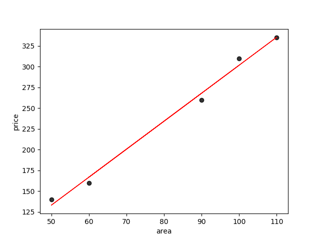
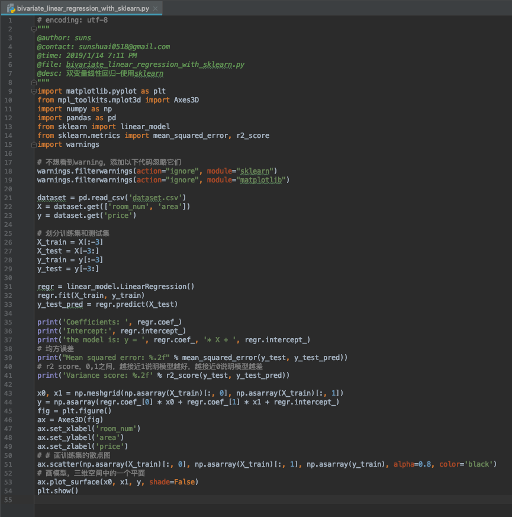
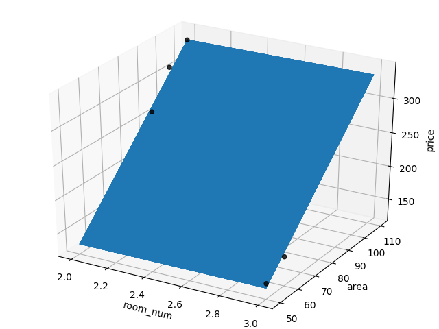
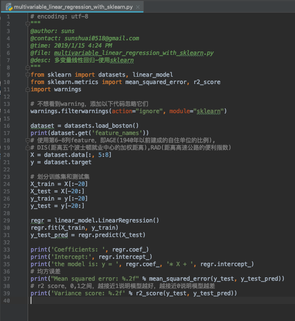

这里使用sklearn框架实现线性回归。使用框架更方便，可以少写很多代码。

写了三个例子，分别是单变量的、双变量的和多变量的。单变量和双变量的画出了图，多变量的由于高维空间难以实现，所以没有画图。单变量和双变量的使用的自己模拟的一个简单的房价数据集，多变量的使用的boston房价数据集。

## 1.单变量线性回归

#### 代码

#### 运行结果

## 2.双变量线性回归

#### 代码

#### 运行结果

## 3.多变量线性回归

#### 代码

#### 运行结果

如果需要代码和数据集，请扫描下面二维码关注公众号【AI developer】，回复【代码】即可免费获取。

