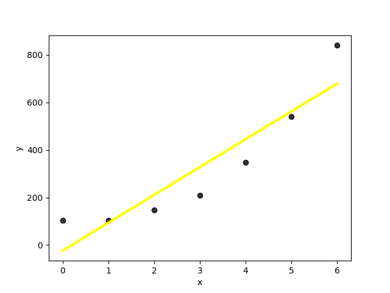
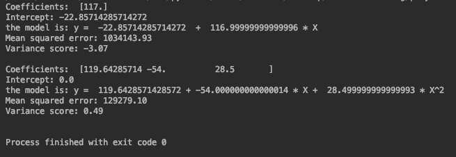

在上一节中我们介绍了线性回归的原理，然后分别用python和sklearn实现了不同变量个数的线性回归的几个例子。线性回归模型形式简单，有很好的可解释性，但是它只适用于X和y之间存在线性关系的数据集。对于非线性关系的数据集，线性回归不能很好的工作。因此本文介绍线性回归模型的扩展——「多项式回归」，我们可以用它来拟合非线性关系的数据集。

假设我们有一个单变量数据集，如下图。

为了观察它们之间的关系，我们用 matplotlib 画出散点图。

从图中看，它们有点像在一条直线上，但仔细看更像是在一个抛物线上。

首先我们假设它们满足线性关系，使用线性回归模型得到的结果如下图中黄线所示。

看起来似乎还可以，但是来看看误差，太大了。

下面我们试试用抛物线拟合它们。

线性回归可以通过从系数构造多项式的特征来扩展。为了使推导过程更具有代表性，我们先以一个双变量的为例，然后再看我们上面的单变量的例子。

双变量线性回归模型形如下面式子：

通过结合二阶多项式的特征，添加二次方项，将它从平面转换为抛物面：

用z替换x：

所以，我们的式子可以写成：

这样就变为线性回归模型。

同理，我们的数据集是单变量的，转换后的式子为：

计算结果如图。

线性回归得到的模型为：

多项式回归得到的模型为：

两个模型如下图所示。

可以看出多项式回归模型的效果（绿线）要明显好于线性回归模型（黄线）。

更高阶的同理。