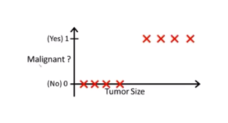
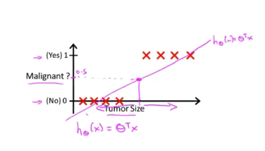
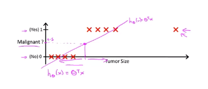
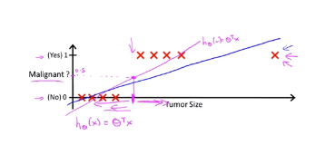
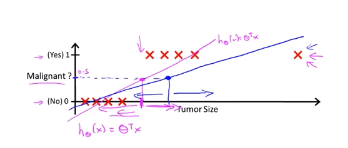
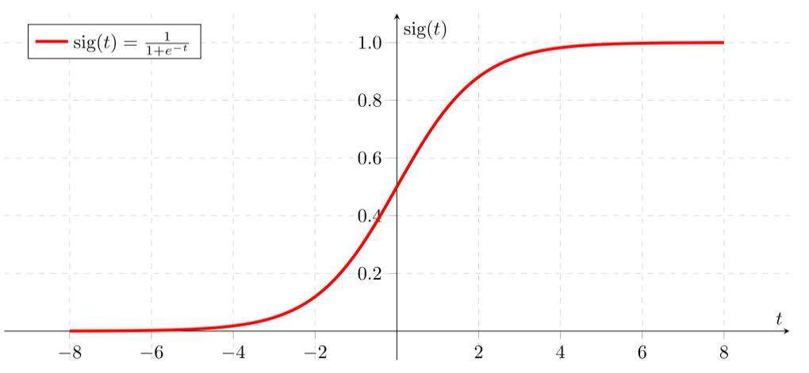
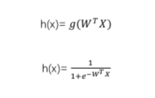
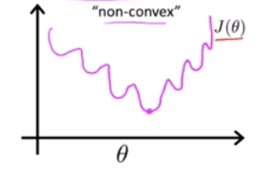
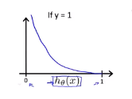
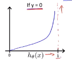

Logistic 回归模型是目前广泛使用的学习算法之一，通常用来解决二分类问题，虽然名字中有“回归”，但它是一个分类算法。有些文献中译为“逻辑回归”，但中文“逻辑”与 logistic 和 logit 的含义相去甚远，因此下文中直接使用 logistic 表示。Logistic 回归的优点是计算代价不高，容易理解和实现；缺点是容易欠拟合，分类精度可能不高。

以肿瘤分类为例，我们要预测肿瘤是否为恶性肿瘤，我们用 0 和 1 表示这两个取值，用 0 表示不是恶性肿瘤，用 1 表示是恶性肿瘤（当然也可以反过来，没有影响），那么数据集如图所示。

假如用线性回归模型来拟合的话，看起来可能会是这样的。

我们可以设置阈值为 0.5，如果输出小于等于 0.5，则预测 y 为 0；输出大于等于 0.5 则预测 y 为 1。

这样红点左边的都被预测为 0，红点右边的都被预测为 1，我们得到了想要的结果。在这个例子中，使用线性回归似乎很合理，即使这是一个分类问题而不是一个回归问题。

但是我们修改一下数据集，将横轴延长，在右边增加一个点，如图。

继续使用线性回归拟合的话，会得到图中蓝色这样一条直线。

如果将阈值设为 0.5 的话，蓝点左边会被预测为 0，蓝点右边会被预测为 1。

显然，此时的线性回归模型表现很差，因为没有很好的拟合数据集。而且使用线性回归还会出现输出值远小于 0 或者远大于 1 的情况。下面我们介绍 logistic 回归模型，它的输出值会介于 0 和 1 之间，不会大于 1，或者小于 0。

我们希望分类器的输出在 0 和 1 之间，因此我们将线性回归得到的输出再做一步计算，使用 sigmoid 函数。sigmoid 函数的公式为：

图像为：

从图像可以看出，sigmoid 函数将负无穷到正无穷之间的数转化为 0 到 1 之间，负无穷处趋向 0 ，正无穷处趋向 1，原点处为 0.5。结合线性回归的假设函数

得到 logistic 回归的假设函数

它的输出都是在 0 到 1 之间，含义是“给出 x 时，y=1的概率”。用公式表示为

在线性回归中，我们使用的代价函数为

转化一下，

则

可以理解为，使模型预测的结果 h(x) 和 实际标签 y 相等时，我们需要模型付出的代价，或者说用这么大的代价来惩罚模型。

最小均方误差的代价函数在线性回归中很好用，但是在 logistic 回归中，如果我们可以最小化这个函数，则模型可以工作。但实际上，在 logistic 回归中，最小均方误差代价函数是参数 W 的非凸函数。形如

因此我们要换一个代价函数。上文已经讲到，它的假设函数含义是“给出 x 时，y=1的概率”。对于单个训练样本，发生的概率为

那么 y=0 时，

将这两个式子合并，得到

取似然函数（即考虑全体样本），

取对数（简化计算过程，详细参考概率论与数理统计），

除以n个样本，

似然函数有极大值，加上负号，使它有极小值，

将假设函数 h(x) 带入，代价函数的最终形式为

为了加深理解，下面分析一下它的含义。对单个训练样本进行分析

当 y=1 时，

从图中可以直观地看出，当假设函数趋于 1 时，代价函数趋于 0，表示预测值与真实值相等，假设函数预测正确，我们不需要模型付出代价。而当假设函数趋于 0 时，与实际值 1 完全不同，代价函数趋于正无穷，表示我们需要模型付出非常大的代价。

当 y=0 时，

含义同理。

然后就可以使用梯度下降法来求解参数了。

