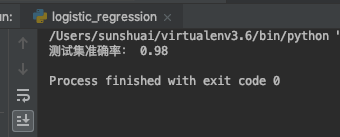
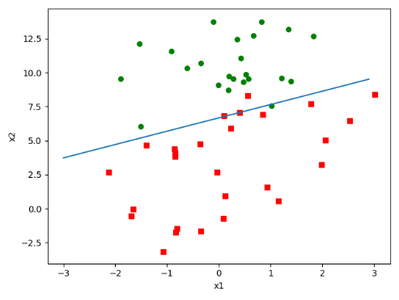

代码：

```python
# encoding: utf-8
"""
@author: suns
@contact: sunshuai0518@gmail.com
@time: 2019/7/1 3:22 PM
@file: logistic_regression_with_sklearn.py
@desc:
"""
from sklearn.model_selection import train_test_split
from sklearn.linear_model import LogisticRegression
from sklearn.metrics import accuracy_score
import numpy as np
import pandas as pd
import matplotlib.pyplot as plt

dataset = pd.read_csv('dataset.csv', delimiter=',')
X = np.asarray(dataset.get(['x1', 'x2']))
y = np.asarray(dataset.get('y'))

# 划分为训练集和测试集
X_train, X_test, y_train, y_test = train_test_split(X, y, test_size=0.5)

# 使用 sklearn 的 LogisticRegression 作为模型，其中有 penalty，solver，dual 几个比较重要的参数，不同的参数有不同的准确率，这里为了简便都使用默认的，详细的请参考 sklearn 文档
model = LogisticRegression(solver='liblinear')

# 拟合
model.fit(X, y)

# 预测测试集
predictions = model.predict(X_test)

# 打印准确率
print('测试集准确率：', accuracy_score(y_test, predictions))

weights = np.column_stack((model.intercept_, model.coef_)).transpose()

n = np.shape(X_train)[0]
xcord1 = []
ycord1 = []
xcord2 = []
ycord2 = []
for i in range(n):
    if int(y_train[i]) == 1:
        xcord1.append(X_train[i, 0])
        ycord1.append(X_train[i, 1])
    else:
        xcord2.append(X_train[i, 0])
        ycord2.append(X_train[i, 1])
fig = plt.figure()
ax = fig.add_subplot(111)
ax.scatter(xcord1, ycord1, s=30, c='red', marker='s')
ax.scatter(xcord2, ycord2, s=30, c='green')
x_ = np.arange(-3.0, 3.0, 0.1)
y_ = (-weights[0] - weights[1] * x_) / weights[2]
ax.plot(x_, y_)
plt.xlabel('x1')
plt.ylabel('x2')
plt.show()
```


运行结果：








<div align=center>
<div style="align: center" >

</div>
